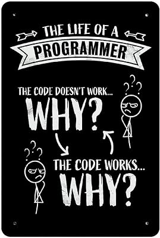

<h1 align="left">Hi Everyone!, This is PRANJAL MRIDUL</h1>
<h3 align="left">A Software Development Engineer (SDE) from India with a passion for building scalable, efficient, and innovative solutions. With experience across various technologies and a keen interest in clean code and best practices, I’m committed to delivering high-quality software.</h3>

  

  

- 🌱 I’m currently learning _**FULL STACK (MERN)**_

- 👨‍💻  Available at [https://www.linkedin.com/in/pmc0707/](https://www.linkedin.com/pmc0707/)]

- 📫 How to reach me _**pranjal.mridul_cs22@gla.ac.in**_

- ⚡ Fun fact _**I failed many times,but I regenerate myself**_ 🔥

  

<h3 align="left">Connect with me:</h3>

<h3 align="left">Languages and Tools:</h3>

      

<svg class="js-activity-overview-graph mx-auto d-block" xmlns="http://www.w3.org/2000/svg" width="286" height="246">
      <title>A graph representing dbc2201's contributions from
      October 15, 2023 to October 16, 2024. The contributions are 100% commits, 0% issues, 0% pull requests, 0% code review.</title>
      <g transform="translate(-18.25, -38.6500244140625)">
        <path class="js-highlight-blob" stroke-linejoin="round" fill="#40c463" stroke="#40c463" opacity="0.5" stroke-width="7" d="M170,170 L170,170 L170,170 L81.45000457763672,170 z"></path>
        <line stroke-width="2" stroke-linecap="round" class="js-highlight-x-axis activity-overview-axis" x1="77.45000457763672" y1="170" x2="262.5499954223633" y2="170"></line>
        <line stroke-width="2" stroke-linecap="round" class="js-highlight-y-axis activity-overview-axis" x1="170" y1="77.45000457763672" x2="170" y2="262.5499954223633"></line>
        <ellipse class="activity-overview-point js-highlight-top-ellipse d-none" rx="3" ry="3" stroke-width="2" fill="white"></ellipse>
        <ellipse class="activity-overview-point js-highlight-right-ellipse d-none" rx="3" ry="3" stroke-width="2" fill="white"></ellipse>
        <ellipse class="activity-overview-point js-highlight-bottom-ellipse d-none" rx="3" ry="3" stroke-width="2" fill="white"></ellipse>
        <ellipse class="activity-overview-point js-highlight-left-ellipse" rx="3" ry="3" stroke-width="2" fill="white" cx="79.45000457763672" cy="170"></ellipse>
        <text text-anchor="middle" class="activity-overview-percentage js-highlight-percent-top" dx="170" dy="51.45000457763672">&nbsp;</text>
        <text text-anchor="middle" class="text-small activity-overview-label js-highlight-label-top" dx="170" dy="67.45000457763672">Code review</text>
        <text text-anchor="start" class="activity-overview-percentage js-highlight-percent-right" dy="158" dx="286.67499554157257">&nbsp;</text>
        <text text-anchor="start" class="text-small activity-overview-label js-highlight-label-right" dy="174" dx="272.5499954223633">Issues</text>
        <text text-anchor="middle" class="activity-overview-percentage js-highlight-percent-bottom" dx="170" dy="264.5499954223633">&nbsp;</text>
        <text text-anchor="middle" class="text-small activity-overview-label js-highlight-label-bottom" dx="170" dy="280.5499954223633">Pull requests</text>
        <text text-anchor="end" class="activity-overview-percentage js-highlight-percent-left" dy="168.5" dx="56.75312900543213">100%</text>
        <text text-anchor="end" class="text-small activity-overview-label js-highlight-label-left" dy="184.5" dx="65.45000457763672">Commits</text>
      </g>
    </svg>

&nbsp;

